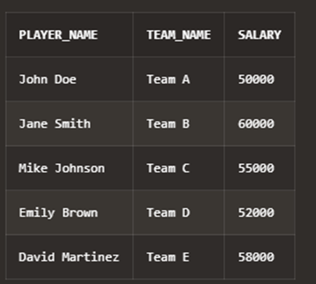
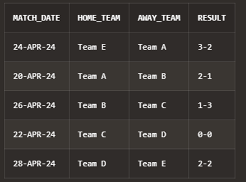
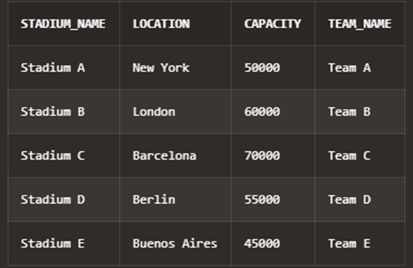
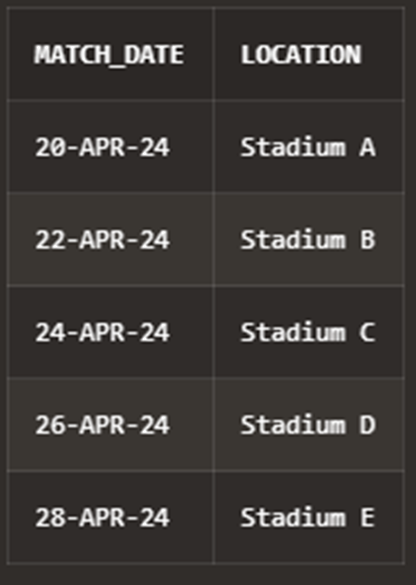
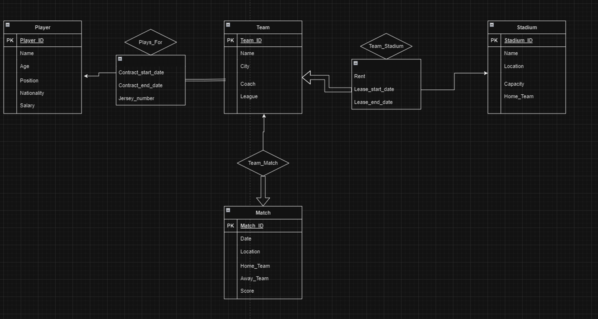
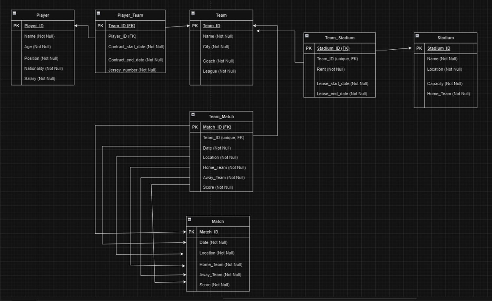

# ⚽ Sports Team Database Project

This project is a relational database designed to model a sports league environment, involving teams, players, stadiums, and matches. The system captures relationships such as player contracts, match results, and team stadium leases, with various cardinalities and integrity constraints.

---

## 📐 Entities and Attributes

### 🧍 Player
- **Attributes**: Player ID, Name, Age, Position, Nationality, Salary

### 🏟️ Stadium
- **Attributes**: Stadium ID, Name, Location, Capacity, Home Team

### 🏙️ Team
- **Attributes**: Team ID, Name, City, Coach, League

### 🏆 Match
- **Attributes**: Match ID, Date, Location, Home Team, Away Team, Result

---

## 🔁 Relationships and Cardinalities

### 👥 Player–Team
- **Type**: One-to-Many
- A player belongs to one team, but a team has many players.
- **Attributes**: Contract Start Date, Contract End Date, Jersey Number

### 🤝 Team–Match
- **Type**: Many-to-Many
- A team can participate in multiple matches; a match involves two teams.
- **Attributes**: Score, Goals Scored, Match Duration

### 🏠 Team–Stadium
- **Type**: One-to-One
- A team has one home stadium; each stadium hosts one team.
- **Attributes**: Rent Amount, Lease Start Date, Lease End Date

---

## 🧱 Database Schema

SQL scripts include:

- `CREATE TABLE` statements for all entities and relationships
- Proper use of primary keys (`PK`) and foreign keys (`FK`)
- Constraints: `NOT NULL`, `UNIQUE`, composite primary keys

Sample tables: `Player`, `Team`, `Matchs`, `Stadium`, `Player_Team`, `Team_Match`, `Team_Stadium`

---

## 📥 Sample Data

The database includes at least 5 entries per table:

- 5 Players (John Doe, Jane Smith, etc.)
- 5 Teams (Team A to Team E)
- 5 Matches (Match IDs 1–5 with results)
- 5 Stadiums
- All necessary relationship entries with realistic data

---

## ❓ Sample SQL Queries

Here are the queries included in the project:

1. **List all players with their teams and salaries**:
   ```sql
   SELECT p.Name AS Player_Name, t.Name AS Team_Name, p.Salary
   FROM Player p
   JOIN Player_Team pt ON p.Player_ID = pt.Player_ID
   JOIN Team t ON pt.Team_ID = t.Team_ID;
   ```


2. **Show the matches with team names and scores**:
   ```sql
   SELECT m.Match_Date, t1.Name AS Home_Team, t2.Name AS Away_Team, m.Result
   FROM Matchs m
   JOIN Team t1 ON m.Home_Team = t1.Team_ID
   JOIN Team t2 ON m.Away_Team = t2.Team_ID;
   ```


3. **Show stadium details and which team plays there**:
   ```sql
   SELECT s.Name AS Stadium_Name, s.Location, s.Capacity, t.Name AS Team_Name
   FROM Stadium s
   JOIN Team t ON s.Home_Team = t.Team_ID;
   ```


4. **Show all players over the age of 25**:
   ```sql
   SELECT Name FROM Player WHERE Age > 25;
   ```


5. **Show all match dates and their locations**:
   ```sql
   SELECT Match_Date, Location FROM Matchs ORDER BY Match_Date;
   ```

---

## 🧩 Diagrams

Diagrams are included to visualize:

- **ER Diagram**: Entity-relationship model with cardinalities and attributes
- **Relational Schema Diagram**: Tables, keys, and relationships with constraints



